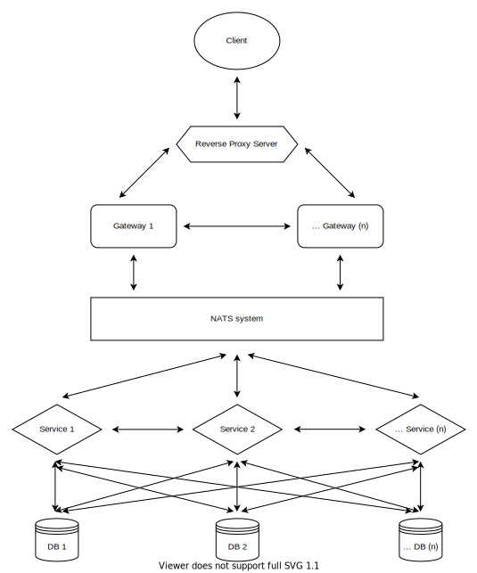

# Microservices template

  

## Getting Started

- Clone this repo.
- Copy `.env` file from someone to your local:

  `cp .env_example .env`.

- Create the `keys` directory if does not exist.
- Create the json web token private key:

  `ssh-keygen -t rsa -b 4096 -E SHA512 -f keys/jwtRS512.key -m PEM`.

- Create the json web token public key:

  `openssl rsa -in keys/jwtRS512.key -pubout -outform PEM -out keys/jwtRS512.key.pub`.

- `docker-compose up -d`.

## After changes in `package.json`, do:

- `docker-compose up -d`.
